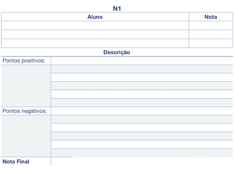

[AVA3 Matutino Equipes]: <https://ava3.furb.br/mod/forum/view.php?id=897299> "AVA3 Equipes"  
[AVA3 Noturno Equipes]: <https://ava3.furb.br/mod/forum/view.php?id=897309> "AVA3 Equipes"  

# Unidade 1: Introdução - atividade

Os assuntos serão sorteados pelo professor e enviados para cada equipe, então não esqueça de definir sua equipe no AVA3 ([AVA3 Matutino Equipes] ou [AVA3 Noturno Equipes]).

O que deve ser feito:

- prepare uma apresentação de no máximo 10 minutos
- escolha a melhor forma de apresentar o conteúdo usando slides, animações, vídeos, exemplos práticos etc.
- em caso de dúvida, converse com o professor.

<!-- 
## Assuntos

### Opção A

**Animação**  
**Percepção Visual**  
**Digitalizador 3D (scanner)**  
Os assuntos de Animação e Percepção Visual tem uma relação entre si. Sugiro apresentarem sobre o assunto Animação e depois quando apresentarem Percepção Visual fazerem a relação com Animação. Tem um TCC que já orientei um bom tempo atrás (20 anos) sobre animação (orientanda Marlise Frotscher Milbratz).  
O hardware Digitalizador 3D (scanner) envolve qualquer equipamento que capture uma nuvem de pontos, e podem ir desde equipamentos médicos (exemplo, ressonância magnética), equipamentos utilizados na produção de animações de personagens para animações (caption motion), até sensores mais “domésticos", tipo o sensor do Kinect (por exemplo o Azure Kinect DK).  

### Opção B

**Modelagem Geométrica / Geometria Computacional**  
**Visualização Científica**  
**Placas Gráficas**  
O assunto Modelagem Geométrica recebe vários nomes na literatura, mas basicamente é uma junção do uso da matemática e estrutura de dados / grafos para auxiliar a Computação Gráfica na resolução de problemas geométricos. Uma biblioteca muito conhecida (por ser de código aberto) é a CGAL (https://www.cgal.org). Mas tem muitas bibliotecas gráficas ou mesmo bibliotecas de "números complexos" que implementam algoritmos de Modelagem Geométrica.  
Já o assunto de Visualização Científica geralmente trata de grande quantidade de valores (dados) que devem ter um limite mínimo de precisão/exatidão aceitáveis. A Visualização Científica auxilia problemas inerentes as áreas da medicina, química, aerodinâmica, dinâmica de fluídos, etc. Tem um TCC que já co-orientei um bom tempo atrás (21 anos) sobre Visualização Científica (orientando George Ruberti Piva, prof. de dinâmica de fluídos da FURB Henry França Meier).  
E o hardware Placa Gráfica entre as várias utilizadas no processo de renderização, também auxiliam muito estas duas áreas, principalmente Visualização Científica, pois permite acelerar o processo de cálculo exigido para renderização final. Outra característica importante a se explorar é o que existe atualmente de configuração das placas mais modernas e seu custo.  

### Opção C

**Interface Humano-Computador**  
**Interface de Usuário Tangível (IUT)**  
**Acelerômetro**  
O assunto Interface Humano-Computador tem uma relação forte com a área gráfica porque se beneficia muito dos recursos de interface gráfica disponíveis atualmente. Acho que podem brevemente comentar sobre Interface Humano-Computador, e então explicar Interface de Usuário Tangível (IUT). Pois, IUT tem uma relação ainda maior com a área gráfica. Ela auxilia o desenvolvimento de produtos, que por exemplo, são usados em Realidade Virtual.  
O nosso grupo de pesquisa já fez alguns trabalhos explorando o uso de IUT. Um deles está em: http://caixae-agua.blogspot.com/. Também tem alguns TCCs que usaram está abordagem, por exemplo do orientando Flávio Omar Losada. Ele construiu um aquário virtual, que se quiserem mostrar na apresentação me avisem durante a apresentação que eu mostro, pois está aqui comigo.  
E o hardware gráfico Acelerômetro pode auxiliar no desenvolvimento de IUT.  

### Opção D

**Sistemas Multimídia**  
**AutoCad**  
**TinkerCad**  
**SketchUp**  
O assunto Sistemas Multimídia é como se fosse uma "provedora" de recursos para a área gráfica. Ela pesquisa o melhor uso de recursos do tipo imagem, audio, video e streaming. E com o constante avanço do hardware, aumentasse a complexidade destes recursos, gerando variações destes recursos em arquivos do tipo DICOM, Street View, ou mesmo renderização de mapas 3D inteiros de cidades (exemplo maps da Apple). Já orientei TCCs relacionados com este assunto, exemplo do orientando Jorge Luis Iten Júnior.  
Já os softwares AutoCad, TinkerCad e SketchUp são ferramentas que podem gerar estes tipos de recursos gráficos.  
-->

## Gabarito

  

----------

## ⏭ [Unidade 2)](../Unidade2/README.md "Unidade 2")  
