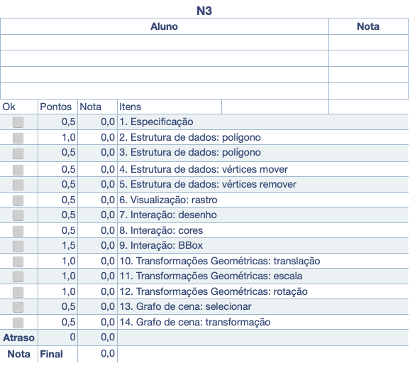

[CSharp to PlantUML]: https://marketplace.visualstudio.com/items?itemName=pierre3.csharp-to-plantuml  
[PlantUML]: https://marketplace.visualstudio.com/items?itemName=jebbs.plantuml  

# Unidade 3: Conceitos Básicos - atividade  

Lembretes:

- todas as questões deste trabalho devem ser desenvolvidas para serem executadas em um **único** projeto.  
- obrigatoriamente devem usar as classes disponibilizadas na Unidade2 junto com as que foram criadas nesta unidade em [CG_N3_Exemplo](./CG_N3_Exemplo/).  
- usem a pasta **Unidade3** do GitHub da sua equipe para desenvolver/entregar o seu código.  

Para saber como deve ser o resultado veja o código: [CG_N3.zip](./CG_N3.zip "CG_N3.zip").  

## O que deve ser feito

O cenário consiste em implementar um Editor Vetorial 2D para "adicionar" e "manipular" polígonos abertos/fechados e convexos/côncavos utilizando somente o teclado e mouse.  

Conhecimento necessário:  

- estruturas simples dinâmicas para armazenar os dados gráficos;  
- algoritmo de seleção: selecionar polígonos côncavos (não entrelaçados);  
- transformações geométricas 2D: movimentar, girar e redimensionar objetos;  
- conceitos básicos de grafo de cena.  

Descrição: o cenário consiste em implementar um Editor Vetorial 2D para "adicionar" e "manipular" polígonos abertos/fechados e convexos/côncavos utilizando somente o teclado e mouse com a biblioteca OpenGL/OpenTK. A aplicação deve permitir "adicionar" interativamente (“clicando” na tela) polígonos sem limite do número de vértices, e sem limite de polígonos. Além disso, cada polígono pode ter sua própria cor e deve ser possível: apagar/mover vértices e apagar/mover polígonos. Estas funções (apagar/mover) devem se interativas (o usuário deve clicar no polígono ou vértice).  

Observação: as funções do OpenGL/OpenTK "glTranslate", "glRotate" e "glScale" não deve ser utilizada para fazer as Transformações Geométricas, e sim deve ser usado a classe "Transformacao4D" associada ao objeto gráfico. Assim o método de desenho do objeto gráfico utiliza "Transformacao4D" junto com as funções do OpenGL/OpenTK "glPushMatrix", "glMultMatrixd"e "glPopMatrix". A justificativa, é que desta forma isolasse o render do OpenGL/OpenTK facilitando, se for o caso, mudar para outra forma de renderizar (por exemplo, DirectX). Para evitar problemas com diferenças de valores entre coordenadas de tela e do espaço gráfico não altere os valores usados no Ortho do exemplo fornecido. Observem que após mover os objetos gráficos usando a matriz de transformação do referido objeto não é possível simplesmente selecionar o objeto usando os seus vértices originais. Tem de pegar o valor das coordenadas de tela (do pixel), converter para o espaço gráfico (do Ortho, se for o caso) e converter para o espaço do objeto gráfico transformado usando as matrizes de transformações do grafo de cena até chegar no objeto desejado.  

**ATENÇÃO** o Editor Vetorial 2D não considera os objetos como Ponto, ou seja, qualquer objeto deve sempre ter no mínimo dois vértices.  

## 1. Especificação

\[Peso 0,5] Especifique as classes, métodos e atributos usando Diagrama de Classes.  
  
Se quiserem, podem usar as extensões:  
[CSharp to PlantUML](https://marketplace.visualstudio.com/items?itemName=pierre3.csharp-to-plantuml)  
[PlantUML](https://marketplace.visualstudio.com/items?itemName=jebbs.plantuml)  
  
A extensão [CSharp to PlantUML] gerar a pasta "plantuml" com os arquivos *.puml para cada classe dos fontes do projeto. Os arquivos \*.puml contém uma descrição textual da diagramação da referida classe.  
Já a extensão [PlantUML] permite gerar os diagramas dos arquivos *.puml no formato SVG (pasta svg).  
Para saber mais sobre o PantIUML ver: <https://plantuml.com/>  

## 2. Estrutura de dados: polígono - adicionar

\[Peso 1,0] Utilize o mouse para clicar na tela com botão direito e poder desenhar um novo polígono.  
Quando pressionar a tecla Enter finaliza o desenho do novo polígono.  

## 3. Estrutura de dados: polígono - remover

\[Peso 0,5] Utilize a tecla D para remover o polígono selecionado.  

## 4. Estrutura de dados: vértices mover

\[Peso 0,5] Utilize a posição do mouse junto com a tecla V para mover vértice mais próximo do polígono selecionado.  

Atenção: no caso do mover o vértice o valores da coordenada é alterada e não os valores da matriz de transformação.  

## 5. Estrutura de dados: vértices remover

\[Peso 0,5] Utilize a tecla E para remover o vértice do polígono selecionado mais próximo do ponto do mouse.  

Atenção: no caso do mover o vértice o valores da coordenada é alterada e não os valores da matriz de transformação.  

## 6. Visualização: rastro

\[Peso 0,5] Exiba o “rasto” ao desenhar os segmentos do polígono.  

## 7. Interação: desenho

\[Peso 0,5] Utilize a tecla P para poder mudar o polígono selecionado para aberto ou fechado.  

## 8. Interação: cores

\[Peso 0,5] Utilize o teclado (teclas R=vermelho,G=verde,B=azul) para trocar as cores dos polígonos selecionado.  

## 9. Interação: BBox

\[Peso 1,5] Utilize o mouse para clicar na tela com botão esquerdo para selecionar o polígono testando primeiro se o ponto do mouse está dentro da BBox do polígono e depois usando o algoritmo Scan Line.  
Caso o polígono seja selecionado se deve exibir a sua BBbox, caso contrário a variável objetoSelecionado deve ser "null", e assim nenhum contorno de BBox deve ser exibido.  

## 10. Transformações Geométricas: translação

\[Peso 1,0] Utilizando as teclas das setas direcionais (cima/baixo,direita,esquerda) movimente o polígono selecionado.  

Atenção: usar matriz de transformação e não alterar os valores dos vértices dos polígonos.  

[Conteúdo](./README.md#translação-homogênea-3d-origem)  

## 11. Transformações Geométricas: escala

\[Peso 1,0] Utilizando as teclas Home/End redimensione o polígono selecionado em relação ao centro da sua BBox.  

Atenção: usar matriz de transformação e não alterar os valores dos vértices dos polígonos.  

[Conteúdo](./README.md#escala-homogênea-3d-origem)  

## 12. Transformações Geométricas: rotação

\[Peso 1,0] Utilizando as teclas numéricas 3 e 4 gire o polígono selecionado em relação ao centro da sua BBox.  

Atenção: usar matriz de transformação e não alterar os valores dos vértices dos polígonos.  

[Conteúdo](./README.md#rotação-homogênea-3d-origem)  

## 13. Grafo de cena: selecionar

\[Peso 0,5] Permita adicionar polígonos “filhos” num polígono selecionado utilizando a estrutura do grafo de cena.  

Atenção: usar matriz de transformação global para acumular transformações de acordo com o grafo de cena.  

[Conteúdo](./README.md#grafo-de-cena)  

## 14. Grafo de cena: transformação

\[Peso 0,5] Considere a transformação global ao transformar (translação/escala/rotação) um polígono “pai”.  

Atenção: usar matriz de transformação global para acumular transformações de acordo com o grafo de cena.  

[Conteúdo](./README.md#grafo-de-cena)  

## Atenção

A avaliação da atividade envolve o desenvolvimento das questões acima apresentadas, mas o mais importante é o integrante da equipe demonstrar conhecimento além do código desenvolvido, também os conceitos apresentados em aula relacionados com a atividade em si.

## Gabarito

  

----------

## ⏭ [Unidade 4)](../Unidade4/README.md "Unidade 4")  
