# Computação Gráfica - Unidade 3  

Interface, Transformações 2D e Seleção, Programação orientada a eventos. Elementos de interface, Eventos e atributos de elementos de interface. Funções callback (teclado e mouse). Transformações de sistemas de coordenadas Transformações geométricas 2D, Algoritmos de seleção, Boundaring Box.  

Objetivo: demonstrar conhecimento no desenvolvimento de sistemas com interface gráfica com o usuário. Interpretar, especificar e desenvolver aplicações simples com transformações geométricas.  
(aulaRabiscos.drawio.svg)

## [Atividades - Aula](./Atividade3.md "Atividades - Aula")  

<!--[ScanLine](./ScanLine.pdf)  -->
<!--[TransformacoesGeometricas](./TransformacoesGeometricas.pdf)  -->

## Material  

### Algoritmo de Seleção

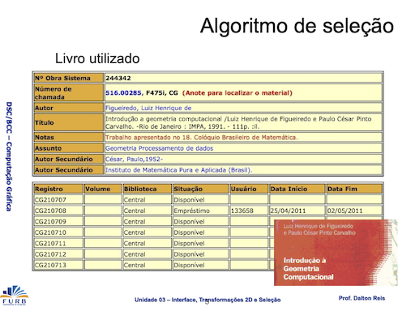  
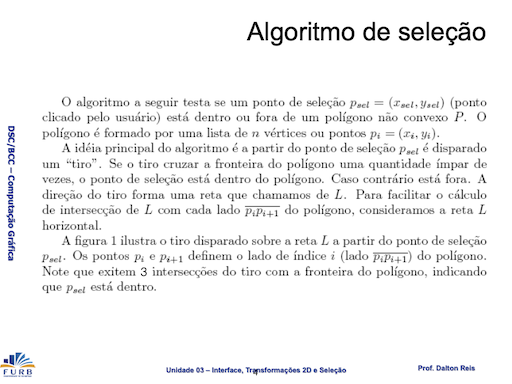  
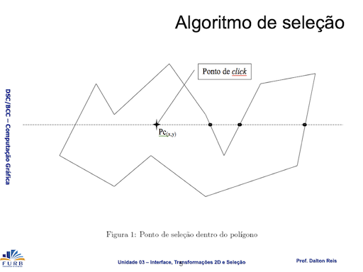  
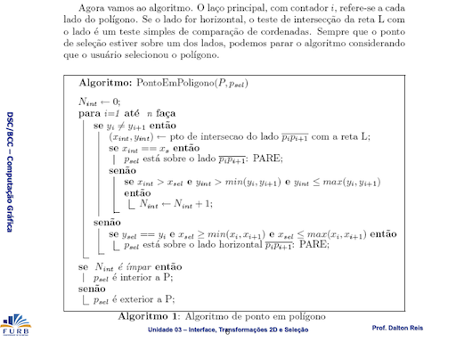  
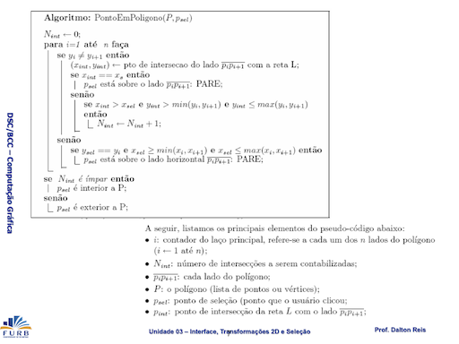  
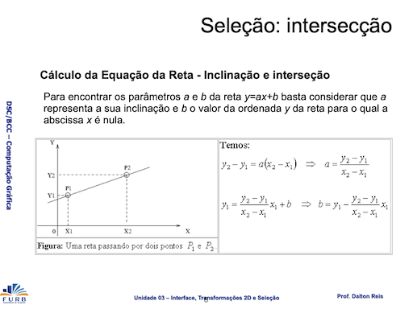  
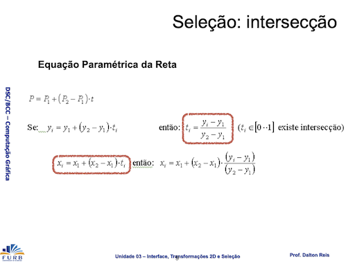  
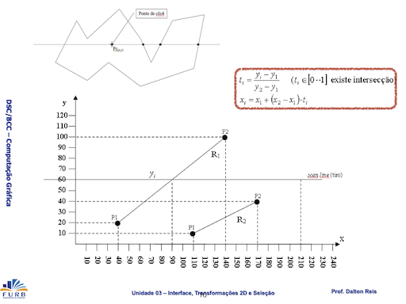  
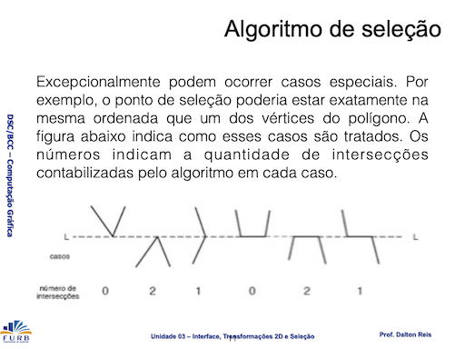  

### [VisEdu-CG]

### Grafo de Cena

Cena:  

- representação abstrata de todos os componentes que são apresentados em um mundo virtual;  
- todo componente que será representado no ambiente e exercerá um comportamento que afeta outros componentes deverá ser anexado à um nó de cena dentro de uma hierarquia.  

Componentes:  

- Objetos Gráficos;  
- Iluminação;  
- Câmera;  
- etc.  

Grafo de Cena:  

- estrutura composta por arcos e nós, em forma de árvore, utilizada para especificar e documentar programas que representam uma cena gráfica;  
- composto por um conjunto de símbolos que representam instâncias de objetos de classes específicas.  

São estruturas de dados, organizadas através de classes, onde por meio de hierarquia de objetos e atributos, pode-se mais facilmente especificar cenas complexas. Cada objeto ou atributo é representado por uma classe, que possui informações sobre sua aparência física, dentre outros fatores. Um grafo de cena trata problemas que geralmente surgem em composições ou gerenciamentos de cenas (POZZER, 2007).  
Popularizado pelo SGI Open Inventor, o grafo de cena protege o desenvolvedor de se preocupar com os detalhes que compõe a renderização, fazendo com que ele foque nos objetos do qual deseja renderizar, ao invés de se preocupar com a lógica da renderização em si (WALSH, 2002).  

Conforme Silva, Raposo e Gattas (2004, p. 3)[^2], “\[...] grafos de cena são ferramentas conceituais para representação de ambientes virtuais tridimensionais nas aplicações de computação gráfica.”. Isso significa que o grafo é uma espécie de mapa para a cena construída, mostrando quais objetos gráficos fazem parte dela, quais objetos possuem filhos, quais suas características (cor, textura, posicionamento etc.). Azevedo, Conci e Vasconcelos (2022, p. 183)[^1] também afirmam que “\[...] é comum que os objetos sejam descritos como malhas poligonais, compostas por conjuntos de vértices e arestas.”. Sendo assim, objetos gráficos são formas compostas por coordenadas que são mapeadas e representadas no mundo gráfico.

<!--
-->

#### Simbologia  

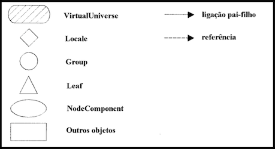  

#### Formalismo  

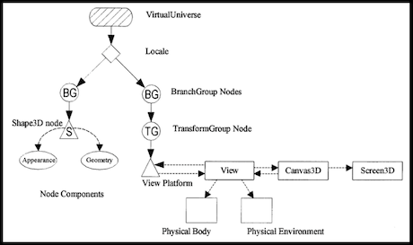  

#### Especificação de um Ambiente Gráfico  

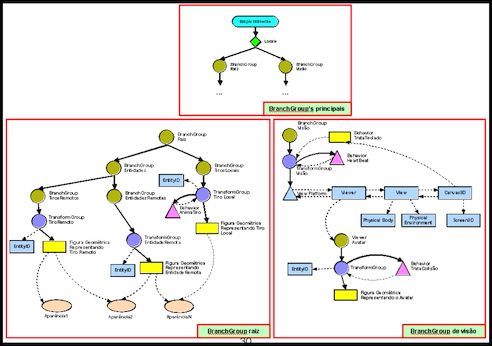  

#### Grafo de Cena: Transformações geométricas

- OpenGL não implementa o grafo de cena  
- Grafo de cena: estrutura a cena facilitando o processamento gráfico  
- Estrutura básica:  
  - Mundo (com lista de objetos gráficos)  
  - Objeto gráfico  
    - Forma: geometria e topologia  
    - Aparência: cor, material, ...  
    - Boundary box  
    - Transformações geométricas  
    - Objetos "filhos": é um novo obj. gráfico (herda transformações do pai)  

### Transformações Geométricas  

As Transformações Geométricas (translação, escala e rotação) do Ponto Médio é a prova de que qualquer segmento de reta pode ser transladado, escalado e rotacionado pela simples Transformação de seus pontos extremos.  
Observação: as transformações são sempre em relação à origem.  

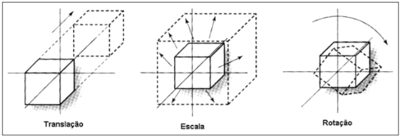  

> [!IMPORTANT]
>
> As transformações de translação, escala e rotação utilizam as operações de soma, multiplicação e seno/cosseno, respectivamente. Mas não são operações aritméticas, mas sim operações geométricas. E no caso de transformações geométricas homogêneas se utiliza **matrizes** para fazer estas operações. A matriz tem a dimensão do espaço gráfico $(x,y,z)$ mais um, onde este mais um é o espaço homogêneo. E para se fazer transformação (translação, escala e rotação) se **multiplica** um ponto por esta matriz.  

<https://github.com/dalton-reis/CG_2024_1/blob/7c4dd0e0890a5f1aa31146d2ad04306c494ab664/CG_Biblioteca/Transformacao4D.cs#L24-L29>

#### Matriz: propriedades

- se deve respeitar a regra das dimensões para poder multiplicar matrizes entre si  

[Exemplo de Multiplicação de Matrizes](https://www.geogebra.org/m/ETHXK756)  

##### Matriz Identidade

A matriz $identidade$ é o elemento neutro na multiplicação de matrizes.

```math
\begin{bmatrix}
   a &  e & i & m \\
   b &  f & j & n \\
   c &  g & k & o \\
   d &  h & l & p
 \end{bmatrix}
\times
\begin{bmatrix}
  1 & 0 & 0 & 0 \\
  0 & 1 & 0 & 0 \\
  0 & 0 & 1 & 0 \\
  0 & 0 & 0 & 1
 \end{bmatrix}
 =
\begin{bmatrix}
   a &  e & i & m \\
   b &  f & j & n \\
   c &  g & k & o \\
   d &  h & l & p
 \end{bmatrix}
```

<https://github.com/dalton-reis/CG_2024_1/blob/7c4dd0e0890a5f1aa31146d2ad04306c494ab664/CG_Biblioteca/Transformacao4D.cs#L56-L64>

#### Translação homogênea 3D: origem

> \[!WARNING]
> Esta transformação é em relação a origem do sistema de referência.  

A translação de um ponto $P(x,y,z)$ no plano ocorre pela adição ás coordenadas de $P$ dos valores de deslocamento $tx$, $ty$ e $tz$, e por ser uma adição o elemento neutro é zero.  

| Transformação | operação          | elemento neutro                      |
| ------------- | ----------------- | ------------------------------------ |
| Translação    | soma              | 0                                    |

##### Translação: Expressão

```math
P(x,y,z) \Rightarrow P(x',y',z')
\space\space\space\space\space\space
\begin{matrix}
x + tx = x' \\
y + ty = y' \\
z + tz = z'
\end{matrix}
```

##### Translação: Matriz

```math
\begin{bmatrix}
  x \space y \space z
\end{bmatrix}
+
\begin{bmatrix}
  dx \space dy \space dz
\end{bmatrix}
=
\begin{bmatrix}
  x' \space y' \space z'
\end{bmatrix}
```

##### Translação: Matriz Homogênea

```math
\begin{bmatrix}
  x \\
  y \\
  z \\
  1
\end{bmatrix}
\times
\begin{bmatrix}
  1 & 0 & 0 & \textcolor{red}{tx} \\
  0 & 1 & 0 & \textcolor{red}{ty} \\
  0 & 0 & 1 & \textcolor{red}{tz} \\
  0 & 0 & 0 & 1
 \end{bmatrix}
 =
 \begin{bmatrix}
  x' \\
  y' \\
  z' \\
  1
\end{bmatrix}
\space\space\space\space\space\space\space\space\space\space\space\space\space\space\space
\begin{bmatrix}
   0 &  4 &  8 & \textcolor{red}{12} \\
   1 &  5 &  9 & \textcolor{red}{13} \\
   2 &  6 & 10 & \textcolor{red}{14} \\
   3 &  7 & 11 & 15
 \end{bmatrix}
```

<https://github.com/dalton-reis/CG_2024_1/blob/7c4dd0e0890a5f1aa31146d2ad04306c494ab664/CG_Biblioteca/Transformacao4D.cs#L66-L74>

#### Escala homogênea 3D: origem

> \[!WARNING]
> Esta transformação é em relação a origem do sistema de referência.  

A escala de um ponto $P(x,y,z)$ no plano ocorre pela multiplicação das coordenadas de $P$ por valores de escala $sx$, $sy$ e $sz$, e por ser uma multiplicação o elemento neutro é um.  

| Transformação | operação          | elemento neutro                      |
| ------------- | ----------------- | ------------------------------------ |
| escala        | multiplicação     | 1                                    |

Fator de escala > 1 amplia  
Fator de escala no intervalo ]0..1\[ reduz  

##### Escala: Expressão

```math
P(x,y,z) \Rightarrow P(x',y',z')
\space\space\space\space\space\space
\begin{matrix}
x \times tx = x' \\
y \times ty = y' \\
z \times tz = z'
\end{matrix}
```

##### Escala: Matriz

```math
\begin{bmatrix}
  x \\
  y \\
  z
\end{bmatrix}
\times
\begin{bmatrix}
  \textcolor{red}{sx} & 0 & 0 \\
  0 & \textcolor{red}{sy} & 0 \\
  0 & 0 & \textcolor{red}{sz}
 \end{bmatrix}
=
\begin{bmatrix}
  x' \\
  y' \\
  z'
\end{bmatrix}
```

##### Escala: Matriz Homogênea

```math
\begin{bmatrix}
  x \\
  y \\
  z \\
  1
\end{bmatrix}
\times
\begin{bmatrix}
  \textcolor{red}{sx} & 0 & 0 & 0 \\
  0 & \textcolor{red}{sy} & 0 & 0 \\
  0 & 0 & \textcolor{red}{sz} & 0 \\
  0 & 0 & 0 & 1
 \end{bmatrix}
 =
 \begin{bmatrix}
  x' \\
  y' \\
  z' \\
  1
\end{bmatrix}
\space\space\space\space\space\space\space\space\space\space\space\space\space\space\space
\begin{bmatrix}
   \textcolor{red}{0} &  4 &  8 & 12 \\
   1 &  \textcolor{red}{5} &  9 & 13 \\
   2 &  6 & \textcolor{red}{10} & 14 \\
   3 &  7 & 11 & 15
 \end{bmatrix}
```

<https://github.com/dalton-reis/CG_2024_1/blob/7c4dd0e0890a5f1aa31146d2ad04306c494ab664/CG_Biblioteca/Transformacao4D.cs#L76-L85>

#### Rotação homogênea 3D: origem

Sentido anti-horário:  
  

> \[!WARNING]
> Esta transformação é em relação a origem do sistema de referência.  

A Rotação de um ponto $P(x,y,z)$ no plano ocorre em relação as dimensões do sistema de referência. No caso de um sistema de referência 3D as rotações serão em relação aos eixos $X$, $Y$ e $Z$ definidos pelo ângulo de rotação.  

| Transformação | operação          | elemento neutro                      |
| ------------- | ----------------- | ------------------------------------ |
| Rotação       | seno / cosseno    | 0° ou múltiplo de 360°               |

[Como chegar na matriz de Rotação](rotacao.md)  

##### Rotação eixo X: Matriz Homogênea

```math
\begin{bmatrix}
  x \\
  y \\
  z \\
  1
\end{bmatrix}
\times
\begin{bmatrix}
  1 & 0 & 0 & 0 \\
  0 & \textcolor{red}{cos\alpha} & \textcolor{red}{-sin\alpha} & 0 \\
  0 & \textcolor{red}{sin\alpha} & \textcolor{red}{cos\alpha} & 0 \\
  0 & 0 & 0 & 1
 \end{bmatrix}
 =
 \begin{bmatrix}
  x' \\
  y' \\
  z' \\
  1
\end{bmatrix}
\space\space\space\space\space\space\space\space\space\space\space\space\space\space\space
\begin{bmatrix}
   0 &  4 &  8 & 12 \\
   1 &  \textcolor{red}{5} &  \textcolor{red}{9} & 13 \\
   2 &  \textcolor{red}{6} & \textcolor{red}{10} & 14 \\
   3 &  7 & 11 & 15
 \end{bmatrix}
```

<https://github.com/dalton-reis/CG_2024_1/blob/7c4dd0e0890a5f1aa31146d2ad04306c494ab664/CG_Biblioteca/Transformacao4D.cs#L87-L96>

##### Rotação eixo Y: Matriz Homogênea

```math
\begin{bmatrix}
  x \\
  y \\
  z \\
  1
\end{bmatrix}
\times
\begin{bmatrix}
  \textcolor{red}{cos\alpha} & 0 & \textcolor{red}{-sin\alpha} & 0 \\
  0 & 1 & 0 & 0 \\
  \textcolor{red}{sin\alpha} & 0 & \textcolor{red}{cos\alpha} & 0 \\
  0 & 0 & 0 & 1
 \end{bmatrix}
 =
 \begin{bmatrix}
  x' \\
  y' \\
  z' \\
  1
\end{bmatrix}
\space\space\space\space\space\space\space\space\space\space\space\space\space\space\space
\begin{bmatrix}
   \textcolor{red}{0} &  4 &  \textcolor{red}{8} & 12 \\
   1 &  5 & 9 & 13 \\
   \textcolor{red}{2} & 6 & \textcolor{red}{10} & 14 \\
   3 &  7 & 11 & 15
 \end{bmatrix}
```

<https://github.com/dalton-reis/CG_2024_1/blob/7c4dd0e0890a5f1aa31146d2ad04306c494ab664/CG_Biblioteca/Transformacao4D.cs#L98-L107>

##### Rotação eixo Z: Matriz Homogênea

```math
\begin{bmatrix}
  x \\
  y \\
  z \\
  1
\end{bmatrix}
\times
\begin{bmatrix}
  \textcolor{red}{cos\alpha} & \textcolor{red}{-sin\alpha} & 0 & 0\\
  \textcolor{red}{sin\alpha} & \textcolor{red}{cos\alpha} & 0 & 0 \\
  0 & 0 & 1 & 0 \\
  0 & 0 & 0 & 1
 \end{bmatrix}
 =
 \begin{bmatrix}
  x' \\
  y' \\
  z' \\
  1
\end{bmatrix}
\space\space\space\space\space\space\space\space\space\space\space\space\space\space\space
\begin{bmatrix}
   \textcolor{red}{0} & \textcolor{red}{4} & 8 & 12 \\
   \textcolor{red}{1} & \textcolor{red}{5} & 9 & 13 \\
   2 & 6 & 10 & 14 \\
   3 &  7 & 11 & 15
 \end{bmatrix}
```

<https://github.com/dalton-reis/CG_2024_1/blob/7c4dd0e0890a5f1aa31146d2ad04306c494ab664/CG_Biblioteca/Transformacao4D.cs#L109-L118>

### Composição de Transformações Geométricas  

As transformações de translação, escala e rotação são **independentes** umas das outras. Mas se pode multiplicar matrizes de transformações entre si para **acumular** transformações, e assim, reduzir expressivamente o custo das transformações de pontos de uma cena. Pois em vez de se multiplicar os pontos de uma cena por uma sequência de matrizes de transformações, se multiplica estas matrizes entre si gerando uma **matriz de transformação global**, e se multiplica os pontos de uma cena por esta matriz para se ter as transformações nos objetos.  

- a multiplicação de matrizes é associativa mas não comutativa  

Ordem das transformações: rotação seguida de uma translação  
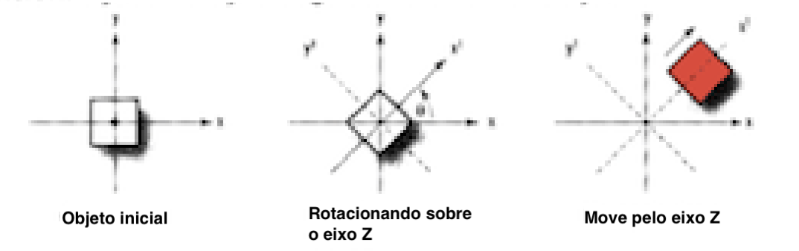

Ordem das transformações: translação seguida de uma rotação  


Observe que o resultado final é diferente, ou seja, a ordem das transformações interfere no resultado após uma sequência de transformações. Caso "clássico é a transformação de escala ou rotação a um ponto fixo, onde se usa a sequência:

- translação para origem em relação ao ponto que se quer fixar a transformação;  
- a transformação, no caso, escala ou rotação;  
- translação inversa da origem para o ponto que se fixou a transformação.  

A multiplicação de diferentes matrizes de transformação, entre si, geram a concatenação de todas as modificações em uma única estrutura, que é chamada de matriz de modelação-visualização. Ela é responsável por determinar dentro de um contexto, as posições e modificações dos objetos 3D de uma cena.  

## Rabiscos

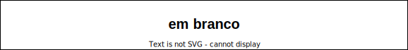  

## ⏭ [Unidade 4)](../Unidade4/README.md "Unidade 4")  

[^1]: AZEVEDO, Eduardo; CONCI, Aura; VASCONCELOS, Cristina. Computação Gráfica: Teoria e Prática: Geração de Imagens. 1. ed. rev. Rio de Janeiro: Alta Books, 2022.  
[^2]: SILVA, Romano J. M. da; RAPOSO, Alberto B.; GATTAS, Marcelo. Grafo de Cena e Realidade Virtual. Rio de Janeiro: PUC, 2004. Disponível em: <https://web.tecgraf.puc-rio.br/~abraposo/INF1366/2007/02_GrafoDeCena_texto.pdf>. Acesso em: 27 nov. 2023.  

[VisEdu-CG]: <https://gcgfurb.github.io/yoda/> "VisEdu-CG"  

<!--
## Download

Nesta pasta tem um executável da atividade 3 que pode ser usado para ajudar a entender o enunciado desta atividade.  
[CG-N3_Executavel](./CG-N3_Executavel/ "CG-N3_Executavel")  

## Dicas de código

Na Classe Mundo.cs adicione *ToolkitOptions*  

```csharp
  class Program
  {
    static void Main(string[] args)
    {
      ToolkitOptions.Default.EnableHighResolution = false;
      Mundo window = Mundo.GetInstance(600, 600);
      window.Title = "CG_N3";
      window.Run(1.0 / 60.0);
    }
  }
}
```

Já na Classe Objeto.cs o método *Desenhar()*  

```csharp
    public void Desenhar()
    {
#if CG_OpenGL
      GL.PushMatrix();                                    // N3-Exe12: grafo de cena
      GL.MultMatrix(matriz.ObterDados());
      GL.Color3(objetoCor.CorR, objetoCor.CorG, objetoCor.CorB);
      GL.LineWidth(primitivaTamanho);
      GL.PointSize(primitivaTamanho);
#endif
      DesenharGeometria();
      for (var i = 0; i < objetosLista.Count; i++)
      {
        objetosLista[i].Desenhar();
      }
      GL.PopMatrix();                                     // N3-Exe12: grafo de cena
    }
```

E ainda, na Classe Objeto.cs um exemplo de método para rotação em relação a origem do SRU  

```csharp
    public void Rotacao(double angulo)
    {
      RotacaoEixo(angulo);
      matriz = matrizTmpRotacao.MultiplicarMatriz(matriz);
    }

```

Já, na Classe Objeto.cs, um exemplo de método para rotação em torno de um ponto  

```csharp
    public void RotacaoEixo(double angulo)
    {
      switch (eixoRotacao)
      {
        case 'x':
          matrizTmpRotacao.AtribuirRotacaoX(Transformacao4D.DEG_TO_RAD * angulo);
          break;
        case 'y':
          matrizTmpRotacao.AtribuirRotacaoY(Transformacao4D.DEG_TO_RAD * angulo);
          break;
        case 'z':
          matrizTmpRotacao.AtribuirRotacaoZ(Transformacao4D.DEG_TO_RAD * angulo);
          break;
      }
    }
```

```csharp
    public void RotacaoZBBox(double angulo)
    {
      matrizGlobal.AtribuirIdentidade();
      Ponto4D pontoPivo = bBox.obterCentro;

      matrizTmpTranslacao.AtribuirTranslacao(-pontoPivo.X, -pontoPivo.Y, -pontoPivo.Z); // Inverter sinal
      matrizGlobal = matrizTmpTranslacao.MultiplicarMatriz(matrizGlobal);

      RotacaoEixo(angulo);
      matrizGlobal = matrizTmpRotacao.MultiplicarMatriz(matrizGlobal);

      matrizTmpTranslacaoInversa.AtribuirTranslacao(pontoPivo.X, pontoPivo.Y, pontoPivo.Z);
      matrizGlobal = matrizTmpTranslacaoInversa.MultiplicarMatriz(matrizGlobal);

      matriz = matriz.MultiplicarMatriz(matrizGlobal);
    }
```

----------
-->
